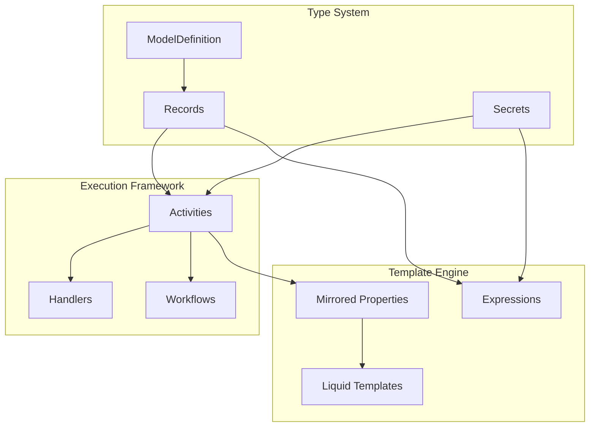

# Architecture Overview

## System Components

### Core Layer
**Workflow Engine**: DAG-based execution runtime
**Type System**: Dynamic resource definition and validation
**Template Engine**: Liquid-based value computation and transformation

### Resource Layer
**Wrapper Model**: Kubernetes-inspired resource structure
**ModelDefinition**: Schema definition system
**Records**: Data instance management
**Secrets**: Credential and secret handling

### Execution Layer
**Activities**: Reusable workflow components
**Handlers**: Pluggable execution backends
**Mirrored Properties**: Dynamic value derivation

## Component Relationships



## Data Flow Patterns

### Resource Definition Flow
1. **ModelDefinition** defines resource schema
2. **Records** instantiate data conforming to schema
3. **Activities** consume Records as typed inputs
4. **Template Engine** resolves references and computes values

### Execution Flow
1. **Workflow** defines activity DAG
2. **Activities** specify input requirements and handlers
3. **Handlers** execute with computed parameters
4. **Mirrored Properties** provide dynamic value transformation

## Handler Architecture

### Tekton PipelineRef Handler
**Components**:
- Schema: Input parameter definitions
- Mirrored: Property transformation logic - computed values accessible via `inputs.*` namespace
- Pipeline: Tekton execution specification

**Capabilities**:
- Kubernetes-native execution
- Secret mounting with auto-cleanup
- File provisioning through volumes
- Parameter passing to pipeline

**Configuration Pattern**:
```yaml
handler:
    type: tekton-pipelineref
    schema:
        properties:
            cluster: {type: object, format: resource}
    mirrored:
        namespace: 
            type: string
            value: "{{inputs.cluster.namespace}}"
    pipeline:
        pipelineRef: aks-helm-install        
        params:
            clusterName: "{{inputs.cluster.name}}"
            namespace: "{{inputs.namespace}}"
        secretMounts:
            azure-creds: azure-service-principal
        files:
            values.yaml: |
                ingress:
                    enabled: true
                    host: "{{inputs.domain}}"
```

### Console Handler
**Capabilities**:
- Direct command execution
- System integration
- Development and debugging

**Use Cases**:
- Simple operations
- Local development
- Quick integrations

## Extension Mechanisms

### Custom Resource Types
1. Define ModelDefinition with schema
2. Create Records as instances
3. Reference in Activity inputs
4. Use in template expressions

### Handler Extensions
New handlers implement standard interface:
- Schema definition for inputs
- Parameter transformation logic
- Execution backend integration

### Template Functions
Liquid template system supports:
- Property access and transformation
- Resource reference resolution
- Conditional logic and iteration
- Built-in helper functions

**Mirrored Property Access**: Computed mirrored properties are accessible in templates via the `inputs.*` namespace alongside direct input properties.

## Security Architecture

### Credential Management
**CredentialDefinition**: Schema for credential types
**Secrets**: Encrypted credential storage
**Handler Integration**: Secure credential injection

### Access Control
- Resource-level permissions
- Handler execution context isolation
- Secret access restrictions

### Secret Handling Patterns
```yaml
# Define credential schema
apiVersion: core.clrslate.io
kind: CredentialDefinition
metadata:
    name: azure-credential
spec:
    schema:
        properties:
            clientId: {type: string}
            clientSecret: {type: string, format: password}
            tenantId: {type: string}

# Create secret instance
apiVersion: secrets.clrslate.io
kind: azure-credential
metadata:
    name: azure-prod
spec:
    clientId: "app-id"
    clientSecret: "secret-value"
    tenantId: "tenant-id"

# Reference in activity
spec:
    inputs:
        properties:
            credential:
                type: object
                format: secret
                specifications:
                    type: azure-credential
```

## Validation Framework

### Schema Validation
- JSON Schema-based property validation
- Type constraint enforcement
- Required property checking
- Format validation for special types

### Reference Validation
- Resource existence verification
- Type compatibility checking
- Circular dependency detection
- Access permission validation

### Template Validation
- Liquid syntax verification
- Property reference validation
- Type conversion checking
- Runtime error prevention

## Performance Considerations

### Resource Loading
- Lazy loading of referenced resources
- Caching for frequently accessed definitions
- Batch loading for workflow execution

### Template Processing
- Template compilation and caching
- Expression evaluation optimization
- Recursive reference handling

### Handler Execution
- Parallel activity execution where possible
- Resource pooling for handlers
- Cleanup automation for temporary resources

## Monitoring and Observability

### Execution Tracking
- Workflow execution logs
- Activity performance metrics
- Handler execution status
- Error tracking and reporting

### Resource Monitoring
- Resource creation and modification audit
- Reference tracking and impact analysis
- Schema evolution tracking
- Usage pattern analysis

## Best Practices

### Resource Design
- Keep schemas focused and cohesive
- Use consistent naming conventions
- Define clear property relationships
- Document schema evolution strategy

### Activity Architecture
- Design for single responsibility
- Minimize external dependencies
- Use mirrored properties for complex logic
- Implement proper error handling

### Handler Selection
- Match handler capabilities to requirements
- Consider execution environment constraints
- Plan for scalability and performance
- Implement monitoring and alerting

### Template Engineering
- Keep templates simple and readable
- Avoid deep nesting and complex logic
- Use helper functions for reusable operations
- Test templates thoroughly before deployment
