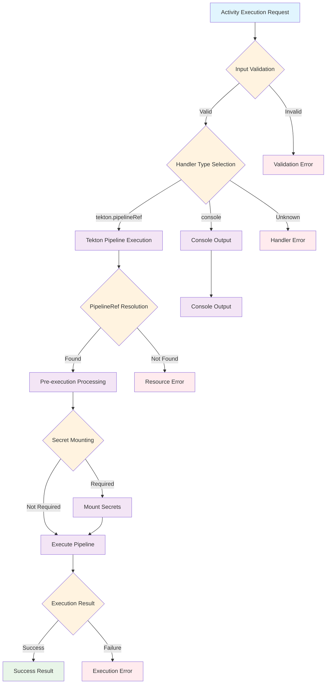

# Execution Framework

The ClrSlate execution framework orchestrates activity execution through a structured handler system. Activities define executable workflow units that encapsulate inputs, resource references, and execution handlers to perform operations within workflows.

## Overview

The execution framework provides the foundation for autonomous activity creation while maintaining strict adherence to documented ClrSlate capabilities and constraints. It supports multiple execution environments through pluggable invocation handlers.

## Core Components

### Activity Structure
Activities follow a standardized structure optimized for machine processing:

```yaml
apiVersion: core.clrslate.io
kind: Activity
metadata:
  name: <qualified-name>
  title: <human-readable-title>
  description: <purpose-description>
  labels:
    category: <functional-category>
  tags: [<operation-tags>]
spec:
  inputs: <input-schema>
  mirrored: <computed-properties>  # optional
  resources: <resource-references>  # optional
  handler: <execution-handler>
```

### Resource Orchestration

Activities can reference external resources through their input schema, enabling complex orchestration patterns:

```yaml
spec:
  inputs:
    properties:
      cluster:
        $ref: "#/definitions/AKSCluster"
      database:
        $ref: "#/definitions/AzureDatabase"
      secrets:
        $ref: "#/definitions/AzureCredentials"
```

**Resource Integration Patterns:**
- **Direct reference**: Activities access resource properties through expressions
- **Computed resolution**: Mirrored properties can transform resource data
- **Handler utilization**: Handlers use resource data for execution context

## AI Decision Framework

### Execution Decision Tree



### Handler Selection Decision Matrix

| Use Case | Handler Type | Rationale | Prerequisites |
|----------|-------------|-----------|---------------|
| Deploy Helm chart | `tekton.pipelineRef` | Requires cluster access, credentials | PipelineRef resource, secret mounting |
| Provision Azure resources | `tekton.pipelineRef` | Complex operations, authentication | Azure credentials, PipelineRef resource |
| Validate configuration | `console` | Output-only, debugging purpose | None |
| Display deployment status | `console` | Information display, no execution | None |
| Run multi-step workflow | `tekton.pipelineRef` | Complex logic, state management | PipelineRef resource |
| Log activity progress | `console` | Simple output, no side effects | None |

## Handler Types

The execution framework supports multiple handler types for different execution scenarios. Each handler provides specific capabilities and constraints.

### Available Handlers

| Handler Type | Purpose | Complexity | Documentation |
|-------------|---------|------------|--------------|
| `console` | Output and debugging | Beginner | [Console Handler](invocation-handlers/console/console.md) |
| `tekton.pipelineRef` | Pipeline execution | Intermediate | [Tekton PipelineRef Handler](invocation-handlers/tekton-pipelineref/tekton-pipelineref.md) |

### Handler Selection

Choose handlers based on execution requirements:

- **Use Console** for debugging, status output, and development workflows
- **Use Tekton PipelineRef** for complex operations, infrastructure tasks, and production deployments

For complete handler documentation and configuration examples, see the [Invocation Handlers](invocation-handlers/index.md) reference.

## Expression System

### Expression Types

| Type | Purpose | Example | Access Pattern |
|------|---------|---------|----------------|
| `resource` | Reference external resources | `"{{inputs.cluster._name}}"` | `spec.*`, `_metadata.*`, `_name` |
| `input` | Access activity inputs | `"{{inputs.namespace}}"` | Direct property access |
| `computed` | Use mirrored properties | `"{{inputs.command}}"` | Dynamic value resolution |

### Resource Expression Resolution

When resource expressions resolve, they provide structured access:

```yaml
# Resource expression: "{{inputs.cluster._name}}"
# Resolves to resource properties:
{
  "spec": {},           # Resource specification (becomes root)
  "_apiVersion": "",    # Resource API version
  "_kind": "",          # Resource kind
  "_metadata": {},      # Complete metadata object
  "_name": ""           # Resource name (shortcut)
}
```

## Templates and Patterns

### Basic Activity Template

```yaml
templateMetadata:
  name: basic-activity
  category: activities
  description: Basic activity with console handler
  complexity: basic
  tags: [console, debugging, basic]
  aiCriteria:
    whenToUse: Simple output or debugging scenarios
    alternatives: [tekton-activity]
    customizationPoints: [inputs, output-template]
  validation:
    required: [metadata.name, spec.inputs, spec.handler]
    optional: [metadata.labels, metadata.tags, spec.mirrored, spec.resources]

apiVersion: core.clrslate.io
kind: Activity
metadata:
  name: "{{QUALIFIED_NAME}}"
  title: "{{DISPLAY_TITLE}}"
  description: "{{DESCRIPTION}}"
  labels:
    category: "{{CATEGORY}}"
  tags:
    - "{{TAG_1}}"
    - "{{TAG_2}}"
spec:
  inputs:
    properties:
      "{{INPUT_NAME}}":
        type: "{{INPUT_TYPE}}"
        title: "{{INPUT_TITLE}}"
        description: "{{INPUT_DESCRIPTION}}"
    required:
      - "{{REQUIRED_INPUT}}"
  handler:
    type: console
    properties:
      output: |
        {{OUTPUT_TEMPLATE}}
```

### Tekton Activity Template

```yaml
templateMetadata:
  name: tekton-activity
  category: activities
  description: Activity with Tekton PipelineRef handler
  complexity: intermediate
  tags: [tekton, pipeline, execution]
  aiCriteria:
    whenToUse: Complex execution requiring containerized environment
    alternatives: [basic-activity]
    customizationPoints: [inputs, pipeline-reference, parameter-mappings]
  validation:
    required: [metadata.name, spec.inputs, spec.handler.properties.pipeline]
    optional: [spec.mirrored, spec.resources, secret-mounting]

apiVersion: core.clrslate.io
kind: Activity
metadata:
  name: "{{QUALIFIED_NAME}}"
  title: "{{DISPLAY_TITLE}}"
  description: "{{DESCRIPTION}}"
  labels:
    category: "{{CATEGORY}}"
  tags:
    - "{{TAG_1}}"
    - "{{TAG_2}}"
spec:
  inputs:
    properties:
      "{{RESOURCE_INPUT}}":
        type: object
        format: resource
        title: "{{RESOURCE_TITLE}}"
        description: "{{RESOURCE_DESCRIPTION}}"
        specifications:
          type: "{{RESOURCE_TYPE}}"
      "{{SECRET_INPUT}}":
        type: object
        format: secret
        title: "{{SECRET_TITLE}}"
        description: "{{SECRET_DESCRIPTION}}"
        specifications:
          type: "{{SECRET_TYPE}}"
    required:
      - "{{REQUIRED_INPUT}}"
  handler:
    type: tekton.pipelineRef
    properties:
      pipeline: "{{PIPELINE_REF_NAME}}"
      inputs:
        "{{PARAM_NAME}}": "{{PARAM_EXPRESSION}}"
        "{{SECRET_NAME}}": "{{SECRET_EXPRESSION}}"
```

### PipelineRef Template

```yaml
templateMetadata:
  name: basic-pipelineref
  category: execution
  description: Basic Tekton PipelineRef with secret mounting
  complexity: intermediate
  tags: [tekton, pipeline, secrets]
  aiCriteria:
    whenToUse: Define reusable pipeline execution patterns
    alternatives: [console-handler]
    customizationPoints: [schema, pipeline-reference, secret-mounting]
  validation:
    required: [metadata.name, spec.schema, spec.pipeline.pipelineRef]
    optional: [spec.mirrored, spec.pipeline.files, secret-mount-configuration]

apiVersion: tekton.clrslate.io
kind: PipelineRef
metadata:
  name: "{{QUALIFIED_NAME}}"
  title: "{{DISPLAY_TITLE}}"
  description: "{{DESCRIPTION}}"
  tags:
    - "{{TAG_1}}"
    - "{{TAG_2}}"
spec:
  schema:
    properties:
      "{{SECRET_PROPERTY}}":
        type: object
        format: secret
        title: "{{SECRET_TITLE}}"
        description: "{{SECRET_DESCRIPTION}}"
        specifications:
          type: "{{SECRET_TYPE}}"
          mount: true
          mountParamName: "{{MOUNT_PARAM_NAME}}"
      "{{INPUT_PROPERTY}}":
        type: "{{INPUT_TYPE}}"
        title: "{{INPUT_TITLE}}"
        description: "{{INPUT_DESCRIPTION}}"
    required:
      - "{{REQUIRED_PROPERTY}}"
  pipeline:
    pipelineRef: "{{TEKTON_PIPELINE_NAME}}"
    params:
      "{{PARAM_NAME}}": "{{PARAM_EXPRESSION}}"
    secretMounts:
      "{{MOUNT_PARAM_NAME}}": "{{SECRET_MOUNT_EXPRESSION}}"
    files:
      "{{FILE_NAME}}": |
        {{FILE_CONTENT_TEMPLATE}}
```

## Validation Rules

### Activity Validation

#### Syntax Validation
- [ ] **ACT-001**: Activity name must follow qualified naming pattern `<domain>.<category>.<name>`
  - **Validation**: Regex pattern `^[a-z]+\.[a-z]+\.[a-zA-Z0-9-]+$`
  - **Error Message**: "Activity name must follow pattern: domain.category.name"
  - **AI Guidance**: Use domain from related resources, category from functionality

- [ ] **ACT-002**: Handler type must be supported value
  - **Validation**: Enum validation against [`tekton.pipelineRef`, `console`]
  - **Error Message**: "Handler type must be one of: tekton.pipelineRef, console"
  - **AI Guidance**: Use decision matrix to select appropriate handler

#### Semantic Validation
- [ ] **ACT-003**: PipelineRef resource must exist when using tekton.pipelineRef handler
  - **Validation**: Cross-reference validation with resource registry
  - **Error Message**: "Referenced PipelineRef resource '{name}' not found"
  - **AI Guidance**: Create PipelineRef resource before Activity, or verify name

- [ ] **ACT-004**: Required inputs must be provided in handler parameter mappings
  - **Validation**: Cross-reference inputs.required with handler.properties.inputs
  - **Error Message**: "Required input '{name}' not mapped in handler parameters"
  - **AI Guidance**: Ensure all required inputs have corresponding parameter mappings

#### Security Validation
- [ ] **ACT-005**: Secret inputs must use proper expression format
  - **Validation**: Secret format inputs must use `{{inputs.secretName._name}}` pattern
  - **Error Message**: "Secret inputs must reference ._name property for mounting"
  - **AI Guidance**: Use ._name suffix for secret references in parameter mappings

### PipelineRef Validation

#### Syntax Validation
- [ ] **PIP-001**: PipelineRef name must follow qualified naming pattern
  - **Validation**: Regex pattern `^[a-z]+\.pipelineRef\.[a-zA-Z0-9-]+$`
  - **Error Message**: "PipelineRef name must follow pattern: domain.pipelineRef.name"
  - **AI Guidance**: Use consistent domain with related activities

- [ ] **PIP-002**: Secret mount configuration must be complete
  - **Validation**: If mount: true, mountParamName must be specified
  - **Error Message**: "Secret mounting requires mountParamName specification"
  - **AI Guidance**: Always specify mountParamName when enabling secret mounting

#### Semantic Validation
- [ ] **PIP-003**: Pipeline reference must exist in Tekton cluster
  - **Validation**: Cross-reference with available Tekton pipelines
  - **Error Message**: "Referenced Tekton pipeline '{name}' not found"
  - **AI Guidance**: Verify pipeline exists or create pipeline definition

- [ ] **PIP-004**: Secret mount parameters must match schema definitions
  - **Validation**: SecretMounts keys must match mountParamName values in schema
  - **Error Message**: "Secret mount parameter '{name}' not defined in schema"
  - **AI Guidance**: Ensure consistency between schema and pipeline configuration

## Handler Development Patterns

### Parameter Mapping Strategy

**Input Validation Pattern**:
```yaml
# Activity inputs define validation rules
inputs:
  properties:
    credentials:
      type: object
      format: secret
      specifications:
        type: azure.secret.clientCredentials
        mount: true
        mountParamName: azureCredentialsRef
  required: [credentials]
```

**Handler Mapping Pattern**:
```yaml
# Map validated inputs to handler parameters
handler:
  type: tekton.pipelineRef
  properties:
    inputs:
      credentials: "{{inputs.credentials._name}}"
      # Use _name for secret references
```

### Secret Handling Pattern

**PipelineRef Secret Configuration**:
```yaml
# In PipelineRef resource
schema:
  properties:
    credentials:
      format: secret
      specifications:
        mount: true
        mountParamName: azureCredentialsRef

# Results in automatic secret mounting
pipeline:
  secretMounts:
    azureCredentialsRef: "{{inputs.credentials._name}}"
```

### Error Handling Patterns

**Validation Failures**:
- Schema validation errors prevent execution
- Resource reference errors block activity start
- Missing required parameters cause immediate failure

**Execution Failures**:
- Tekton pipeline failures propagate to activity status
- Console handler errors are limited to template resolution
- Secret mounting failures prevent pipeline execution

## Examples

### Basic Console Activity Example

```yaml
apiVersion: core.clrslate.io
kind: Activity
metadata:
  name: debug.activity.showConfig
  title: Show Configuration
  description: Display configuration values for debugging
  labels:
    category: Debug
  tags:
    - debug
    - console
spec:
  inputs:
    properties:
      environment:
        type: string
        title: Environment
        description: Target environment name
        enum: ["dev", "staging", "prod"]
      namespace:
        type: string
        title: Namespace
        description: Target namespace
        default: default
    required:
      - environment
  handler:
    type: console
    properties:
      output: |
        🔍 Configuration Display
        =======================
        Environment: {{inputs.environment}}
        Namespace: {{inputs.namespace}}
        
        Configuration validated and ready for use.
```

### Advanced Tekton Activity Example

```yaml
apiVersion: core.clrslate.io
kind: Activity
metadata:
  name: azure.activity.runScript
  title: Run Azure Script
  description: Execute Azure CLI script with credential mounting
  labels:
    category: Azure
  tags:
    - azure
    - script
    - tekton
spec:
  inputs:
    properties:
      credentials:
        type: object
        format: secret
        title: Azure Credentials
        description: Azure service principal credentials
        specifications:
          type: azure.secret.clientCredentials
      script:
        type: string
        title: Script Content
        description: Azure CLI script to execute
    required:
      - credentials
      - script
  handler:
    type: tekton.pipelineRef
    properties:
      pipeline: azure.pipelineRef.azure-script
      inputs:
        credentials: "{{inputs.credentials._name}}"
        script: "{{inputs.script}}"
```

### Complete PipelineRef Example

```yaml
apiVersion: tekton.clrslate.io
kind: PipelineRef
metadata:
  name: azure.pipelineRef.azure-script
  title: Azure Script
  description: Pipeline reference for executing Azure CLI scripts
  tags:
    - tekton
    - azure
    - script
spec:
  schema:
    properties:
      credentials:
        type: object
        format: secret
        title: Azure Credentials
        description: Azure credentials for authentication
        specifications:
          type: azure.secret.clientCredentials
          mount: true
          mountParamName: azureCredentialsRef
      script:
        type: string
        title: Target Script
        description: Azure CLI script content
    required:
      - credentials
      - script
  pipeline:
    pipelineRef: azure.pipelines.azure-script
    params:
      script: '{{inputs.script}}'
    secretMounts:
      azureCredentialsRef: "{{inputs.credentials._name}}"
```

## Execution Constraints

### Resource Dependencies
- Activities can reference multiple resources through the `resources` section
- Resource expressions must resolve before handler execution
- Resource types must match declared specifications

### Input Validation
- All required inputs must be provided before execution
- Secret specifications must include proper mount configuration
- Resource format inputs require valid resource references

### Handler Limitations
- Only documented handler types are supported (`tekton.pipelineRef`, `console`)
- Handler properties must match expected schema
- Expression syntax must follow documented patterns

### PipelineRef Constraints
- Must reference existing Tekton pipeline in cluster
- Secret mounting requires complete configuration (mount: true, mountParamName)
- Parameter mappings must align with target pipeline parameters

## Performance Considerations

### Execution Efficiency
- Resource resolution occurs once per activity execution
- Expression evaluation is cached during single execution
- Secret mounting adds overhead to Tekton pipeline startup

### Scalability Factors
- Tekton pipelines scale with cluster resources
- Console handlers have minimal resource impact
- Complex expressions may impact resolution time

### PipelineRef Performance
- Pipeline creation overhead for each execution
- Secret mounting increases startup time
- File templating processed during pipeline creation

## Related Documentation

### Core References
- **[Model Definition](./model-definition.md)** - Resource schema definitions
- **[Secret Definition](./secret-definition.md)** - Secret management patterns
- **[Wrapper Model](./wrapper-model.md)** - Base resource structure
- **[Execution Examples](./execution-examples.md)** - Complete working examples

### Handler Documentation
- **[Invocation Handlers](./invocation-handlers/index.md)** - Handler overview and selection guide
- **[Console Handler](./invocation-handlers/console/console.md)** - Output and debugging handler
- **[Tekton PipelineRef Handler](./invocation-handlers/tekton-pipelineref/tekton-pipelineref.md)** - Pipeline execution handler

### Templates and Examples
- **[Activity Templates](../templates/activities/)** - Reusable activity patterns
- **[Execution Templates](../templates/execution/)** - PipelineRef and resource templates

## Quick Reference

### Handler Selection Quick Guide

| Need | Use Handler | Template |
|------|-------------|----------|
| Debug output | `console` | `basic-activity` |
| Complex execution | `tekton.pipelineRef` | `tekton-activity` |
| Azure operations | `tekton.pipelineRef` | `azure-script-activity` |
| Validation display | `console` | `validation-activity` |

### Expression Syntax Quick Reference

```yaml
# Input access
"{{inputs.propertyName}}"

# Resource access
"{{inputs.resourceName._name}}"     # Resource name
"{{inputs.resourceName.spec.*}}"    # Resource specification

# Secret access (for mounting)
"{{inputs.secretName._name}}"       # Secret name for mounting

# Computed property access
"{{inputs.propertyName}}"          # Mirrored/computed values
```
