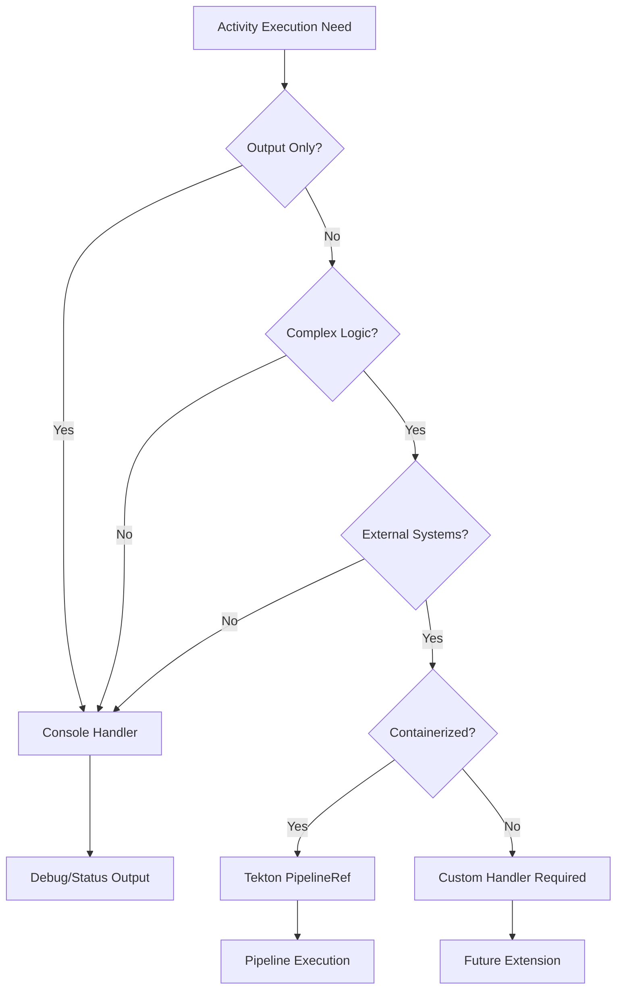

# Invocation Handlers

Invocation handlers define how ClrSlate activities execute their operations. Each handler type provides specific capabilities and constraints for different execution scenarios.

## Available Handlers

### Production Handlers

| Handler | Purpose | Complexity | Use Cases |
|---------|---------|------------|-----------|
| [Tekton PipelineRef](tekton-pipelineref/tekton-pipelineref.md) | Complex pipeline execution | Intermediate | Infrastructure provisioning, deployments, CI/CD |
| [Console](console/console.md) | Output and debugging | Beginner | Debugging, logging, status reporting |

## Handler Selection Guide

### Decision Matrix



### Selection Criteria

#### Use Console Handler When:
- ✅ Displaying configuration values
- ✅ Debugging input resolution
- ✅ Status reporting and logging
- ✅ Development and testing
- ✅ Simple output formatting

#### Use Tekton PipelineRef Handler When:
- ✅ Complex multi-step operations
- ✅ Containerized execution environments
- ✅ Azure/cloud credential handling
- ✅ Infrastructure provisioning
- ✅ CI/CD pipeline integration
- ✅ File templating and injection

## Handler Architecture

### Common Interface

All handlers follow a consistent interface pattern:

```yaml
handler:
  type: <handler-type>
  properties:
    <handler-specific-configuration>
```

### Expression Support

All handlers support the ClrSlate expression system:

| Expression Type | Pattern | Purpose |
|----------------|---------|---------|
| Input Access | `{{inputs.property}}` | Access activity inputs |
| Resource Reference | `{{inputs.resource._name}}` | Reference resource identifiers |
| Resource Properties | `{{inputs.resource.property}}` | Access resource specifications |
| Computed Values | `{{inputs.computed}}` | Use calculated properties |

## Configuration Patterns

### Basic Handler Configuration
```yaml
# Console handler - simple output
handler:
  type: console
  properties:
    output: "Deploying {{inputs.appName}} to {{inputs.namespace}}"

# Tekton handler - pipeline execution
handler:
  type: tekton.pipelineRef
  properties:
    pipeline: deployment-pipeline
    inputs:
      appName: "{{inputs.appName}}"
      namespace: "{{inputs.namespace}}"
```

### Advanced Configuration with Resources
```yaml
handler:
  type: tekton.pipelineRef
  properties:
    pipeline: azure-deployment
    inputs:
      cluster: "{{inputs.aksCluster._name}}"
      credentials: "{{inputs.azureCredentials._name}}"
      region: "{{inputs.aksCluster.location}}"
```

## Validation and Constraints

### Universal Validation Rules
- Handler type must be valid and available
- All template expressions must resolve successfully
- Referenced resources must exist and be accessible
- Handler-specific validation must pass

### Common Constraints
- Expressions are read-only (cannot modify inputs)
- Resource access limited to specified patterns
- Execution context determined by handler capabilities
- Error handling follows consistent patterns

## Development Guidelines

### Handler Selection Process
1. **Identify execution requirements** - What needs to be accomplished?
2. **Assess complexity** - Simple output vs. complex operations?
3. **Consider infrastructure** - Local vs. containerized execution?
4. **Evaluate security** - Secret handling requirements?
5. **Select appropriate handler** - Match capabilities to requirements

### Best Practices
- **Start simple**: Use Console handler for development and debugging
- **Scale complexity**: Move to Tekton PipelineRef for production operations
- **Validate early**: Test handler configurations in development
- **Monitor execution**: Track handler performance and error rates
- **Follow patterns**: Use established configuration patterns

### Error Prevention
- Validate all expression syntax before deployment
- Ensure all referenced resources exist
- Test handler configurations with sample data
- Implement proper error handling in activities
- Monitor handler execution logs

## Extension and Customization

### Future Handler Types
The invocation handler system is designed for extensibility. Potential future handlers include:

- **REST API Handler**: Direct HTTP/REST API invocations
- **Azure Function Handler**: Serverless function execution
- **Container Handler**: Direct container execution
- **Script Handler**: Local script execution
- **Webhook Handler**: External webhook notifications

### Custom Handler Development
While not currently supported, the architecture allows for custom handler development following the established patterns and interfaces.

## Performance Considerations

### Handler Performance Characteristics

| Handler | Startup Time | Resource Usage | Scalability | Best For |
|---------|-------------|----------------|-------------|----------|
| Console | Instant | Minimal | High | Development, debugging |
| Tekton PipelineRef | Medium | Cluster resources | Medium-High | Production workflows |

### Optimization Strategies
- Choose the simplest handler that meets requirements
- Cache handler configurations when possible
- Monitor resource usage patterns
- Optimize pipeline definitions for Tekton handlers
- Use appropriate resource limits and requests

## Related Documentation

- [Execution Framework](../execution-framework.md) - Core execution concepts and patterns
- [Execution Examples](../execution-examples.md) - Complete activity examples
- [Model Definition](../model-definition.md) - Resource model specifications
- [Wrapper Model](../wrapper-model.md) - Resource wrapper patterns

## Quick Reference

### Handler Types
- `console` - Output and debugging
- `tekton.pipelineRef` - Pipeline execution

### Expression Patterns
- `{{inputs.*}}` - Activity inputs
- `{{inputs.resource._name}}` - Resource names
- `{{inputs.*}}` - Computed properties

### Selection Checklist
- [ ] Execution requirements identified
- [ ] Complexity level assessed
- [ ] Infrastructure requirements considered
- [ ] Security needs evaluated
- [ ] Handler capabilities matched to requirements

## Handler Documentation and Examples

### Console Handler
- **[Console Handler Documentation](console/console.md)** - Complete handler specification
- **[Console Handler Examples](console/examples.md)** - Working examples and patterns

For debug activities, validation displays, configuration summaries, and status reports.

### Tekton PipelineRef Handler  
- **[Tekton PipelineRef Handler Documentation](tekton-pipelineref/tekton-pipelineref.md)** - Complete handler specification
- **[Tekton PipelineRef Handler Examples](tekton-pipelineref/examples.md)** - Working examples and patterns

For deployment workflows, infrastructure operations, and containerized execution
