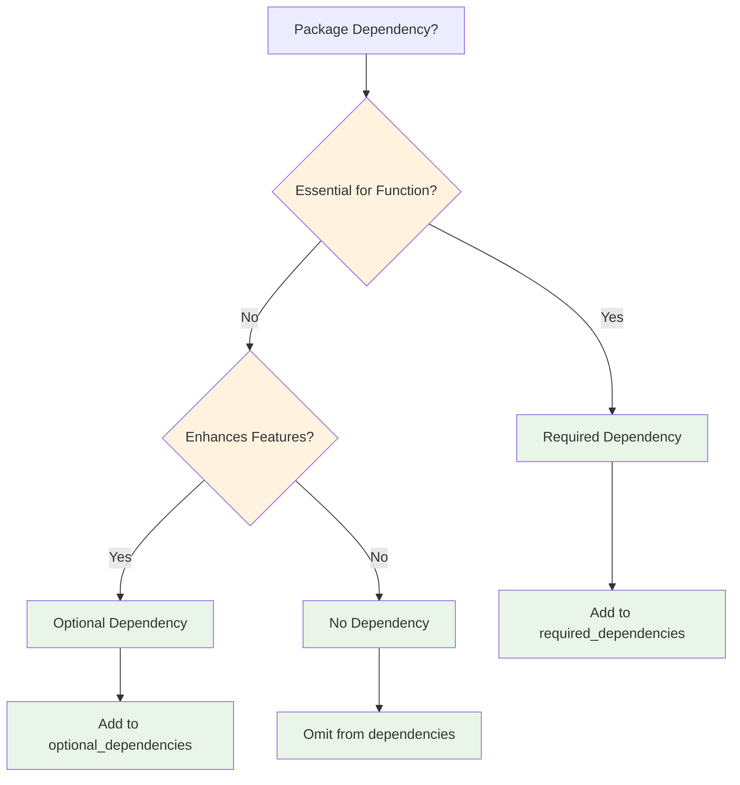
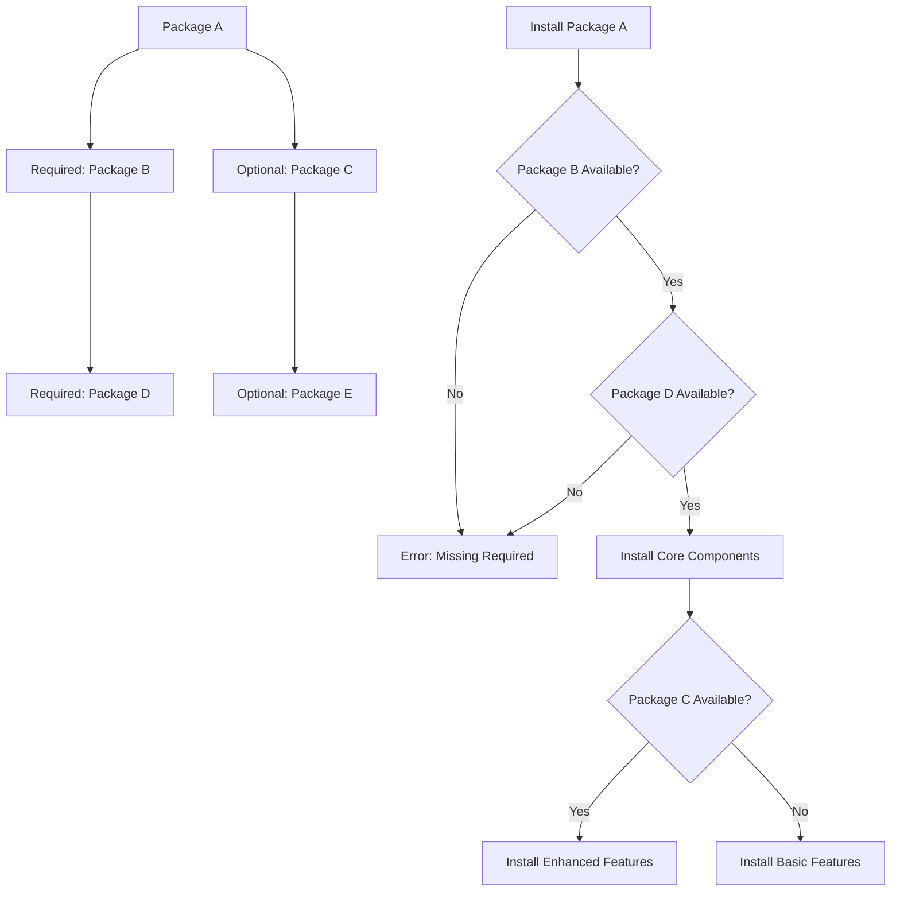

# Package Metadata Specification

## Overview

Package metadata defines essential information about ClrSlate packages including identification, dependencies, and configuration. The metadata.yaml file serves as the package descriptor and enables package discovery, dependency resolution, and platform integration.

## Core Concepts

### Metadata Purpose
Package metadata provides structured information that enables:
- **Package Identification**: Unique naming and versioning
- **Dependency Management**: Required and optional package relationships
- **UI Integration**: Visual representation and display information
- **Platform Integration**: Owner information and maintenance details

### Metadata Schema
The metadata follows a structured YAML schema with required and optional fields that define package characteristics and relationships.

## Required Metadata Schema

### metadata.yaml Structure
```yaml
name: <package-name>                    # Required: Unique package identifier
version: <semantic-version>             # Required: Package version (x.y.z)
title: <display-title>                  # Required: Human-readable name
description: <package-description>      # Required: Purpose and capabilities
owner: <owner-identifier>               # Required: Maintainer information
icon: <icon-name>                       # Required: Visual representation

# Optional: Dependencies
optional_dependencies:                  # Optional: Packages that enhance functionality
  - <package-name>
  - <package-name>
required_dependencies:                  # Optional: Packages required for functionality
  - <package-name>

# Optional: Extended metadata
color: <color-value>                    # Optional: UI color coding
keywords:                              # Optional: Search keywords
  - <keyword>
maintainers:                           # Optional: Maintainer details
  - name: <maintainer-name>
    email: <email-address>
```

### Required Fields

#### Package Identification
| Field | Type | Description | Validation |
|-------|------|-------------|------------|
| `name` | string | Unique package identifier using kebab-case | Must be unique, kebab-case format |
| `version` | string | Semantic version (major.minor.patch) | Must follow semver format |
| `title` | string | Human-readable display name | Descriptive, clear title |
| `description` | string | Clear description of package purpose | Explains package capabilities |
| `owner` | string | Package owner or maintainer | Identifies responsible party |
| `icon` | string | Visual representation from predefined set | Must use predefined icon values |

#### Field Specifications

**Name Requirements**:
- Use kebab-case (lowercase with hyphens)
- Reflect primary domain or technology
- Examples: `azure`, `helm`, `k8s`, `istio`

**Version Requirements**:
- Follow semantic versioning (x.y.z)
- Increment appropriately for changes
- Examples: `0.1.0`, `1.2.3`, `2.0.0`

**Icon Requirements**:
- Must use predefined icon values
- Technology-specific or generic icons
- Examples: `Azure.Logo`, `Kubernetes.Helm`, `Generic.Database`

## Optional Fields

### Dependency Management
```yaml
optional_dependencies:                  # Packages that enhance functionality
  - k8s                                # Example: Kubernetes integration
  - externalDns                        # Example: DNS management
required_dependencies:                  # Packages required for functionality
  - azure                             # Example: Cloud provider dependency
```

### Extended Metadata
```yaml
color: '#0078D7'                       # UI color coding (hex format)
keywords:                              # Search and discovery keywords
  - helm
  - kubernetes
  - deployment
maintainers:                           # Detailed maintainer information
  - name: ClrSlate Team
    email: team@clrslate.io
```

## Icon System

### Technology-Specific Icons
```
# Cloud Providers
Azure.Logo, Azure.AKS, Azure.DevOps
Amazon.Aws
Google.Gcp

# Container Orchestration
Kubernetes.Logo, Kubernetes.Helm
Brands.Istio, Brands.Nginx

# Databases
Brands.MongoDb, Brands.PostgreSql, Brands.MySql, Brands.Redis
Brands.ElasticSearch

# Version Control
Brands.GitHub, Brands.GitLab, Brands.Git

# CI/CD
Brands.Jenkins

# Programming Languages
Brands.VisualStudio, Brands.DotNet, Brands.Python, Brands.Java
Brands.Nodejs, Brands.Ruby
```

### Generic Icons
```
# General Purpose
Generic.Database, Generic.Streaming, Generic.Messaging
Generic.Stack, Generic.Robot, Generic.AI
```

## Real-World Examples

### Azure Package Metadata
```yaml
name: azure
version: 0.1.0
title: Azure
description: Azure cloud infrastructure resources
owner: Team ClrSlate
icon: Azure.Logo
color: '#0078D7'

optional_dependencies:
  - k8s
  - externalDns
required_dependencies: []
```

### Helm Package Metadata
```yaml
name: helm
version: 0.0.1
title: Helm Package
description: Helm Package
owner: Team ClrSlate
icon: Kubernetes.Helm
keywords:
  - helm
  - kubernetes
  - deployment
maintainers:
  - name: ClrSlate Team
    email: team@clrslate.io
```

### Istio Package Metadata
```yaml
name: istio
version: 1.0.0
title: Istio Service Mesh
description: Istio service mesh configuration and deployment
owner: Team ClrSlate
icon: Brands.Istio
color: '#466BB0'

required_dependencies:
  - k8s
  - helm
optional_dependencies: []
```

## AI Decision Framework

### Dependency Type Selection


### Icon Selection Guidelines
| Package Type | Icon Category | Examples |
|--------------|---------------|----------|
| Cloud Provider | Technology-Specific | `Azure.Logo`, `Amazon.Aws` |
| Container Platform | Kubernetes Icons | `Kubernetes.Logo`, `Kubernetes.Helm` |
| Database | Database Brands | `Brands.MongoDb`, `Brands.PostgreSql` |
| Programming Language | Language Brands | `Brands.Python`, `Brands.DotNet` |
| General Purpose | Generic Icons | `Generic.Database`, `Generic.Stack` |

## Dependency Management

### Dependency Strategies

#### Required Dependencies
Use when package **cannot function** without dependency:
```yaml
required_dependencies:
  - k8s                    # Kubernetes package required for k8s resources
  - azure                  # Azure package required for Azure operations
```

#### Optional Dependencies
Use when package **enhanced by** dependency:
```yaml
optional_dependencies:
  - monitoring             # Adds monitoring capabilities
  - logging               # Adds logging integration
```

### Dependency Design Principles
1. **Minimize required dependencies** to reduce coupling
2. **Use optional dependencies** for enhanced functionality
3. **Avoid circular dependencies** between packages
4. **Document integration patterns** with dependencies

### Dependency Resolution


## Validation Rules

### Required Field Validation
- [ ] **META001**: `name` field exists and uses kebab-case
- [ ] **META002**: `version` field exists and follows semver format
- [ ] **META003**: `title` field exists and is descriptive
- [ ] **META004**: `description` field exists and explains purpose
- [ ] **META005**: `owner` field exists and identifies maintainer
- [ ] **META006**: `icon` field exists and uses predefined value

### Optional Field Validation
- [ ] **META007**: `color` field uses valid hex format if present
- [ ] **META008**: `keywords` are relevant and descriptive if present
- [ ] **META009**: `maintainers` have valid email format if present
- [ ] **META010**: Dependencies reference existing packages

### Dependency Validation
- [ ] **DEP001**: Required dependencies exist and are available
- [ ] **DEP002**: Optional dependencies exist if referenced
- [ ] **DEP003**: No circular dependencies exist
- [ ] **DEP004**: Dependency versions are compatible

## Templates and Patterns

### Basic Package Metadata Template
```yaml
name: {{package-name}}
version: 1.0.0
title: {{Package Display Name}}
description: {{Clear description of package purpose and capabilities}}
owner: {{Owner/Team Name}}
icon: {{Appropriate Icon Value}}

# Dependencies (if needed)
required_dependencies: []
optional_dependencies: []
```

### Enhanced Package Metadata Template
```yaml
name: {{package-name}}
version: 1.0.0
title: {{Package Display Name}}
description: {{Clear description of package purpose and capabilities}}
owner: {{Owner/Team Name}}
icon: {{Appropriate Icon Value}}
color: '{{#HexColor}}'

keywords:
  - {{keyword1}}
  - {{keyword2}}

maintainers:
  - name: {{Maintainer Name}}
    email: {{email@domain.com}}

required_dependencies:
  - {{required-package}}
optional_dependencies:
  - {{optional-package}}
```

## Usage Examples

### Creating New Package Metadata
1. **Choose unique package name** using kebab-case
2. **Set initial version** (typically 0.1.0 or 1.0.0)
3. **Write clear title and description**
4. **Select appropriate icon** from predefined set
5. **Define dependencies** (required vs optional)
6. **Add optional metadata** as needed

### Updating Package Metadata
1. **Increment version** following semver rules
2. **Update description** if functionality changes
3. **Review dependencies** for new requirements
4. **Add keywords** for better discoverability
5. **Update maintainer information** if needed

## Quick Reference

### Metadata Checklist
- [ ] Package name is unique and uses kebab-case
- [ ] Version follows semantic versioning
- [ ] Title is clear and descriptive
- [ ] Description explains package purpose
- [ ] Owner identifies maintainer
- [ ] Icon uses predefined value
- [ ] Dependencies are correctly categorized
- [ ] Optional fields add value

### Common Patterns
| Pattern | Usage | Example |
|---------|-------|---------|
| Cloud Provider | Infrastructure packages | `azure`, `aws`, `gcp` |
| Tool Integration | Development tools | `helm`, `tekton`, `github` |
| Service Deployment | Application services | `mongodb`, `redis`, `nginx` |
| Platform Extension | Platform capabilities | `monitoring`, `logging`, `security` |

## Related Documentation

- **[Package Structure](./package-structure.md)** - Directory structure and file organization
- **[Platform Introduction](../introduction.md)** - Core platform concepts and package overview
- **[Dependency Management](./dependency-management.md)** - Advanced dependency patterns
- **[Package Validation](../validation/package-validation.md)** - Validation rules and testing

---

*This specification is based on analysis of real ClrSlate package metadata from azure, helm, istio, and other catalog packages.*
