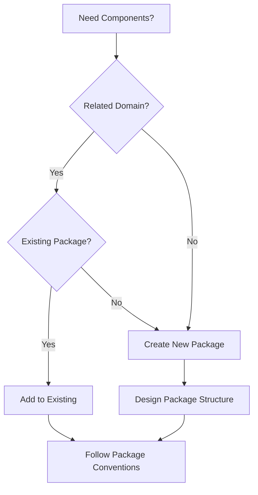
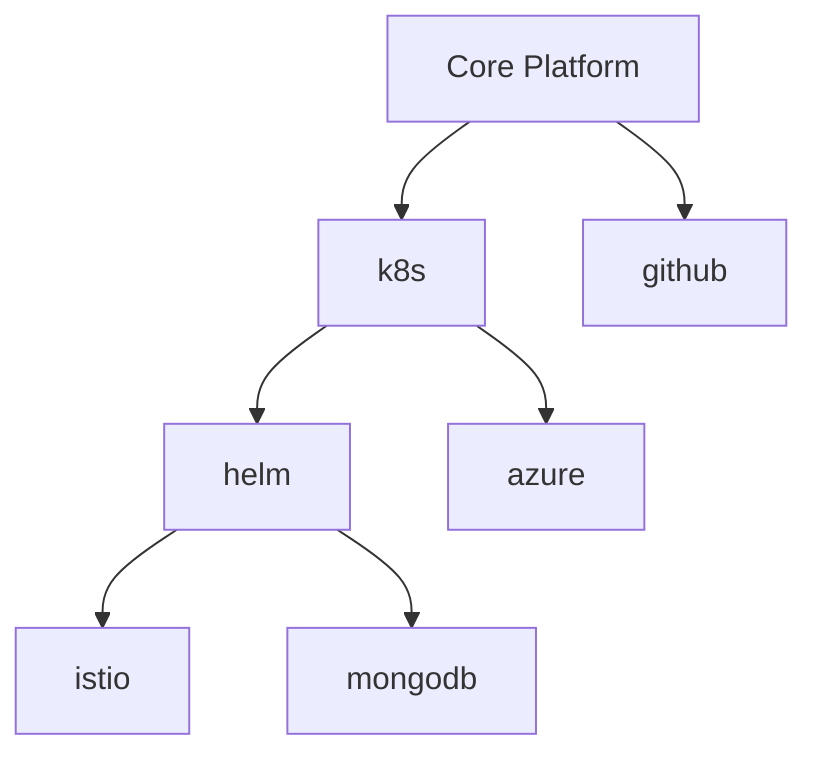

# Package Structure Specification

## Overview

ClrSlate packages organize related components (models, activities, handlers, resources) into logical groupings with standardized structure and metadata. This specification defines the required directory structure, file naming conventions, and organization patterns for ClrSlate packages.

## Core Concepts

### Package Definition
A package is a collection of related ClrSlate components organized in a standardized directory structure with metadata that enables discovery, dependency management, and platform integration.

### Component Organization
Components are organized by type and function within dedicated directories, following consistent naming patterns that enable automated processing and human comprehension.

### Dependency Management
Packages can declare required and optional dependencies on other packages, enabling modular composition and reusable component libraries.

## Standard Package Directory Structure

### Required Package Layout
```
package-name/
├── metadata.yaml              # Required: Package metadata and dependencies
├── README.md                  # Required: Package documentation
├── activities/                # Activity definitions
│   └── *.yaml
├── models/                    # ModelDefinition and CredentialDefinition files
│   └── *.yaml
├── resources/                 # Resource instances and configurations
│   ├── helmCharts/           # Helm chart configurations
│   └── helmReleases/         # Helm release configurations
├── configs/                   # Configuration files and mappings
│   ├── import.mappings.yaml  # Data import mappings
│   └── *.yaml               # Package-specific configurations
├── pipelines/                 # Tekton pipeline definitions
│   └── *.pipeline.yaml
└── pipelineRefs/             # Tekton PipelineRef handler definitions
    └── *.yaml
```

### Directory Purposes

#### Required Files
| File | Purpose | Validation |
|------|---------|------------|
| `metadata.yaml` | Package metadata, dependencies, and configuration | Required fields validation |
| `README.md` | Package documentation and usage guidance | Content structure validation |

#### Component Directories
| Directory | Contains | When to Include |
|-----------|----------|-----------------|
| `activities/` | Activity definitions that consume models and execute handlers | When package provides workflow operations |
| `models/` | ModelDefinition and CredentialDefinition schemas | When package defines custom data types |
| `resources/` | Resource instances (Records) and platform-specific configurations | When package includes deployable resources |
| `configs/` | Package configuration files and data mappings | When package requires configuration data |
| `pipelines/` | Tekton pipeline YAML definitions for execution | When package uses Tekton execution |
| `pipelineRefs/` | Tekton PipelineRef handler definitions for activity execution | When package uses Tekton PipelineRef handlers |

## File Naming Conventions

### Activity Files
```
activities/
├── create-<resource-type>.yaml        # Creation activities
├── delete-<resource-type>.yaml        # Deletion activities
├── deploy-<component>.yaml            # Deployment activities
└── <action>-<target>.yaml             # General pattern
```

### Model Files
```
models/
├── <resource-type>.yaml               # Primary resource models
├── credentials.yaml                   # Credential definitions
└── <domain>-<type>.yaml              # Domain-specific models
```

### Resource Files
```
resources/
├── helmCharts/
│   └── <chart-name>.yaml             # Helm chart configurations
├── helmReleases/
│   └── <release-name>.yaml           # Helm release configurations
└── <resource-category>/
    └── <resource-name>.yaml
```

### Pipeline Files
```
pipelines/
└── <package>-<purpose>.pipeline.yaml  # Pipeline definitions

pipelineRefs/
└── <action>-<target>.yaml            # PipelineRef handler configurations
```

## Real-World Package Examples

### Azure Package Structure
```
azure/
├── metadata.yaml
├── README.md
├── activities/
│   ├── create-aks-cluster.yaml
│   └── create-resource-group.yaml
├── models/
│   ├── aks.yaml
│   ├── credentials.yaml
│   ├── resourceGroup.yaml
│   └── subscription.yaml
├── configs/
│   ├── import.mappings.yaml
│   └── Locations.yaml
├── pipelines/
│   ├── azure-aks-script.pipeline.yaml
│   └── azure-script.pipeline.yaml
└── pipelineRefs/
    └── azure-script.yaml
```

### Helm Package Structure
```
helm/
├── metadata.yaml
├── README.md
├── activities/
│   ├── helm-chart-install.yaml
│   ├── helm-release-install.yaml
│   └── helm-uninstall.yaml
├── models/
│   ├── helmchart.yaml
│   └── helmrelease.yaml
└── pipelineRefs/
    ├── helm-chart-install.yaml
    └── helm-uninstall.yaml
```

### Istio Package Structure
```
istio/
├── metadata.yaml
├── README.md
├── activities/
│   ├── deployIstioBase.yaml
│   ├── deployIstiod.yaml
│   └── deployIstioIstioGateway.yaml
└── resources/
    └── helmCharts/
        ├── helmCharts.istio-base.yaml
        ├── helmCharts.istiod.yaml
        └── helmCharts.istio-istioGateway.yaml
```

## AI Decision Framework

### When to Create New Package


### Directory Selection Guidelines
| Component Type | Directory | Criteria |
|----------------|-----------|----------|
| Workflow operations | `activities/` | Defines executable workflow steps |
| Data schemas | `models/` | Defines custom resource types |
| Configuration data | `resources/` | Provides deployable instances |
| Setup parameters | `configs/` | Contains package configuration |
| Execution pipelines | `pipelines/` | Tekton pipeline definitions |
| Pipeline handlers | `pipelineRefs/` | Tekton PipelineRef handler definitions |

## Package Organization Strategies

### Domain-Based Organization
Group packages by technical domain:
- **Cloud Providers**: `azure`, `aws`, `gcp`
- **Container Orchestration**: `k8s`, `helm`, `istio`
- **Databases**: `mongodb`, `postgresql`, `redis`
- **CI/CD**: `github`, `tekton`, `jenkins`

### Dependency Hierarchies


## Validation Rules

### Package Structure Validation
- [ ] **PKG001**: `metadata.yaml` file exists and is valid
- [ ] **PKG002**: `README.md` file exists with required sections
- [ ] **PKG003**: Directory structure follows standard layout
- [ ] **PKG004**: File naming follows conventions
- [ ] **PKG005**: Component files are valid YAML

### Naming Validation
- [ ] **NAME001**: Package name uses kebab-case
- [ ] **NAME002**: File names follow established patterns
- [ ] **NAME003**: No naming conflicts within package
- [ ] **NAME004**: Component names are descriptive

### Content Validation
- [ ] **CONTENT001**: Activities reference valid models
- [ ] **CONTENT002**: Models follow schema requirements
- [ ] **CONTENT003**: Resources conform to model definitions
- [ ] **CONTENT004**: Handlers match available types

## Templates and Patterns

### Basic Package Template
```yaml
# Directory structure template
package-name/
├── metadata.yaml              # Required
├── README.md                  # Required
├── activities/                # Optional: Include if workflow operations needed
├── models/                    # Optional: Include if custom schemas needed
├── resources/                 # Optional: Include if deployable resources needed
├── configs/                   # Optional: Include if configuration data needed
├── pipelines/                 # Optional: Include if Tekton pipelines needed
└── pipelineRefs/             # Optional: Include if Tekton PipelineRef handlers needed
```

### Component Creation Pattern
1. **Identify component type** (activity, model, resource, etc.)
2. **Select appropriate directory** based on component type
3. **Apply naming convention** for the component type
4. **Create component file** following ClrSlate specifications
5. **Update package documentation** to reflect new component

## Quick Reference

### Package Creation Checklist
- [ ] Choose descriptive package name (kebab-case)
- [ ] Create required files: `metadata.yaml`, `README.md`
- [ ] Design directory structure based on component needs
- [ ] Follow file naming conventions
- [ ] Define clear dependencies (required vs optional)
- [ ] Create comprehensive README with usage examples
- [ ] Validate package structure and content

### Directory Usage Guidelines
| Need | Include | Omit If |
|------|---------|---------|
| Workflow operations | `activities/` | No workflow steps needed |
| Custom data types | `models/` | Using only standard types |
| Deployable instances | `resources/` | No resource instances |
| Configuration data | `configs/` | No package configuration |
| Pipeline execution | `pipelines/` | Not using Tekton |
| Pipeline references | `pipelineRefs/` | No external pipeline references |
| Custom execution | `invocation-handlers/` | Using standard handlers only |

## Related Documentation

- **[Package Metadata](./package-metadata.md)** - Package metadata schema and dependency management
- **[Platform Introduction](../introduction.md)** - Core platform concepts and package overview
- **[ModelDefinition](./model-definition.md)** - Data schema definitions for package models
- **[Activities](../execution/activities.md)** - Activity definitions for package operations

---

*This specification is based on analysis of real ClrSlate packages: azure, helm, k8s, istio, and others from the catalog.*
