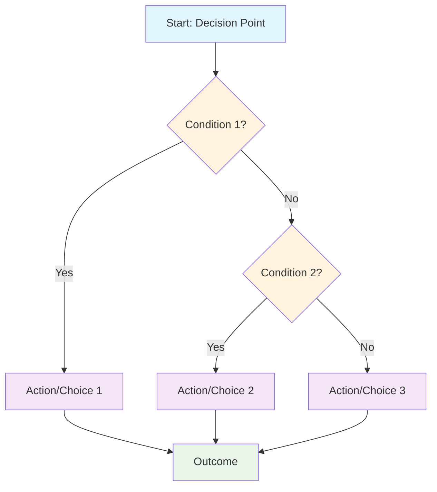
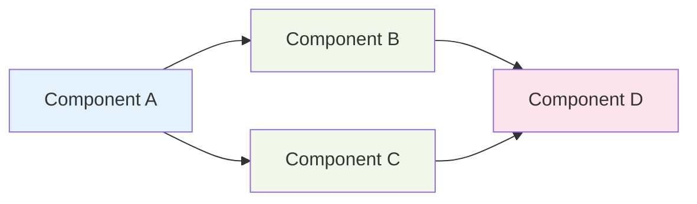
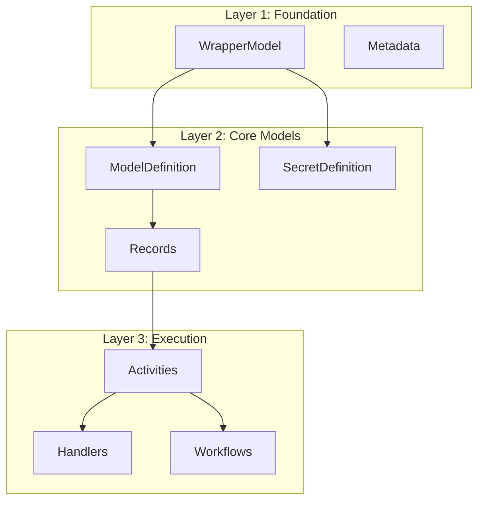

# ClrSlate Documentation v2 Rules and Standards

## Overview

This document establishes the comprehensive rules and standards for ClrSlate v2 documentation, specifically optimized for AI agent consumption and autonomous package creation. All documentation must follow these standards to ensure consistency, discoverability, and AI-readiness.

## Document Structure Standards

### Structured Metadata Format

Every documentation file must include YAML front matter with the following structure:

```yaml
---
type: <document-type>              # Required: specification | guide | reference | example | template
category: <category-name>          # Required: core-concept | execution | security | integration
complexity: <complexity-level>    # Required: basic | intermediate | advanced
prerequisites: [<prereq-list>]    # Required: List of prerequisite knowledge/documents
outputs: [<output-list>]          # Required: What this document helps create/understand
lastUpdated: <date>               # Auto-generated: YYYY-MM-DD format
version: <version>                # Auto-generated: Semantic version
---
```

**Document Types:**
- `specification`: Formal component specifications (ModelDefinition, Activity, etc.)
- `guide`: How-to guides and tutorials
- `reference`: Quick reference materials and lookup tables  
- `example`: Complete examples and use cases
- `template`: Reusable patterns and templates

**Categories:**
- `core-concept`: Basic platform concepts and data models
- `execution`: Activities, handlers, and workflows
- `security`: SecretDefinition and security patterns
- `integration`: Cross-platform and external integrations
- `foundation`: Documentation standards and infrastructure

**Complexity Levels:**
- `basic`: Fundamental concepts, no prerequisites
- `intermediate`: Builds on basic concepts, some prerequisites
- `advanced`: Complex scenarios, multiple prerequisites

### Content Structure Standards

All documentation must follow this structure:

````markdown
# Document Title

## Overview
Brief description of what this document covers and its purpose for AI agents.

## Core Concepts
### Concept 1
- Definition
- Purpose
- AI Decision Criteria

### Concept 2
- Definition  
- Purpose
- AI Decision Criteria

## Specification/Implementation Details
[Detailed technical content]

## AI Decision Framework
### When to Use
- Criteria and conditions
- Decision flowchart (Mermaid)

### Selection Guidelines
- Comparison with alternatives
- Performance considerations
- Security implications

## Templates and Patterns
### Template Name
```yaml
# Template content with annotations
```

### Usage Pattern
- When to apply
- Customization points
- Validation requirements

## Validation Rules
### Required Properties
- [ ] Property 1: Description and validation
- [ ] Property 2: Description and validation

### Optional Properties
- [ ] Property A: Description and default behavior
- [ ] Property B: Description and default behavior

### Cross-Reference Validation
- [ ] Dependency 1: Validation rule
- [ ] Dependency 2: Validation rule

## Examples
### Basic Example
[Simple, complete example with explanation]

### Advanced Example
[Complex scenario demonstrating advanced features]

## Related Documentation
- [Link to prerequisite docs]
- [Link to dependent docs]
- [Link to related concepts]

## Quick Reference
[Summary table or quick lookup information]
````

## Mermaid Diagram Standards

### Decision Tree Standard

All decision trees must follow this format:



### Dependency Diagram Standard



### Architecture Diagram Standard



## AI Agent Optimization Guidelines

### Decision Framework Standards

Every component documentation must include:

1. **When to Use Section**
   - Clear criteria for component selection
   - Comparison with alternatives
   - Performance implications

2. **Decision Flowchart**
   - Mermaid diagram showing decision logic
   - Clear yes/no decision points
   - Outcome actions

3. **Validation Checklist**
   - Required property validation
   - Cross-reference validation
   - Security validation (where applicable)

### Template Documentation Pattern

All templates must include:

```yaml
# Template Metadata
template:
  name: <template-name>
  category: <category>
  complexity: <level>
  useCase: <description>
  
# AI Selection Criteria
aiCriteria:
  whenToUse: <conditions>
  alternatives: [<list>]
  considerations: <factors>
  
# Template Content
apiVersion: <version>
kind: <kind>
metadata:
  # ... template fields with {{placeholders}}
spec:
  # ... specification with {{placeholders}}
```

### Validation Rule Documentation Format

```markdown
## Validation Rules

### Syntax Validation
- [ ] **Rule ID**: Description
  - **Validation**: Technical validation logic
  - **Error Message**: User-friendly error message
  - **AI Guidance**: How AI should handle this validation

### Semantic Validation  
- [ ] **Rule ID**: Description
  - **Validation**: Cross-reference validation logic
  - **Error Message**: User-friendly error message
  - **AI Guidance**: How AI should handle this validation

### Security Validation
- [ ] **Rule ID**: Description
  - **Validation**: Security constraint validation
  - **Error Message**: User-friendly error message
  - **AI Guidance**: How AI should handle this validation
```

## Naming Conventions

### File Naming
- Use lowercase with hyphens: `model-definition.md`
- Group related files in directories: `core/`, `execution/`, `examples/`
- Use consistent suffixes: `-guide.md`, `-reference.md`, `-template.yaml`

### Resource Naming
- Follow ClrSlate conventions: `<domain>.<category>.<type>.<name>`
- Examples: `azure.model.aks`, `helm.activity.install`, `auth.secret.credentials`

### Template Naming
- Category prefix: `modeldef-`, `activity-`, `secret-`
- Use case description: `basic-crud`, `multi-service`, `database-connection`
- Full example: `modeldef-basic-crud.yaml`

## Cross-Reference Standards

### Linking Format
```markdown
- **Core Concept**: [ModelDefinition](../core/model-definition.md)
- **Related Pattern**: [CRUD Template](../templates/modeldef-basic-crud.yaml)
- **Decision Support**: [Handler Selection](../reference/handler-selection.md)
```

### Navigation Updates
Every document creation/update must:
1. Update `index.md` with new content
2. Add appropriate cross-references
3. Update relevant reference materials
4. Validate all links work correctly

## Template Library Organization

### Directory Structure
```
v2/templates/
├── model-definitions/
│   ├── basic-crud.yaml
│   ├── resource-reference.yaml
│   └── secret-integration.yaml
├── activities/
│   ├── tekton-pipeline.yaml
│   ├── console-debug.yaml
│   └── validation-check.yaml
├── secrets/
│   ├── azure-credentials.yaml
│   ├── database-connection.yaml
│   └── api-keys.yaml
└── packages/
    ├── basic-deployment.yaml
    ├── multi-service.yaml
    └── monitoring-setup.yaml
```

### Template Metadata Schema
```yaml
# Required in every template file
templateMetadata:
  name: <unique-name>
  category: <model-definitions|activities|secrets|packages>
  description: <purpose-and-usage>
  complexity: <basic|intermediate|advanced>
  tags: [<searchable-tags>]
  aiCriteria:
    whenToUse: <selection-criteria>
    alternatives: [<alternative-templates>]
    customizationPoints: [<configurable-aspects>]
  validation:
    required: [<required-customizations>]
    optional: [<optional-customizations>]
  examples:
    basic: <simple-usage-example>
    advanced: <complex-usage-example>
```

## Update and Maintenance Procedures

### Documentation Updates
1. Update document content
2. Update `lastUpdated` field in front matter
3. Increment version number if significant changes
4. Update cross-references if structure changes
5. Update index.md and reference materials
6. Validate all links and examples

### Template Updates
1. Update template content
2. Update template metadata
3. Update related documentation references
4. Validate template with current platform version
5. Update examples that use the template

### Navigation Maintenance
1. Regular link validation (monthly)
2. Index.md reorganization as content grows
3. Reference material updates with new content
4. Dead link removal and redirection

## Quality Assurance Checklist

### Before Publishing Any Document
- [ ] Front matter metadata complete and accurate
- [ ] Content follows structure standards
- [ ] Mermaid diagrams follow style guidelines
- [ ] AI decision framework included
- [ ] Validation rules documented
- [ ] Templates provided where applicable
- [ ] Cross-references updated
- [ ] Examples tested and validated
- [ ] Quick reference section included

### AI Agent Readiness Validation
- [ ] Decision criteria clearly defined
- [ ] Alternative options documented
- [ ] Error scenarios covered
- [ ] Validation rules automatable
- [ ] Templates customizable
- [ ] Examples demonstrate best practices
