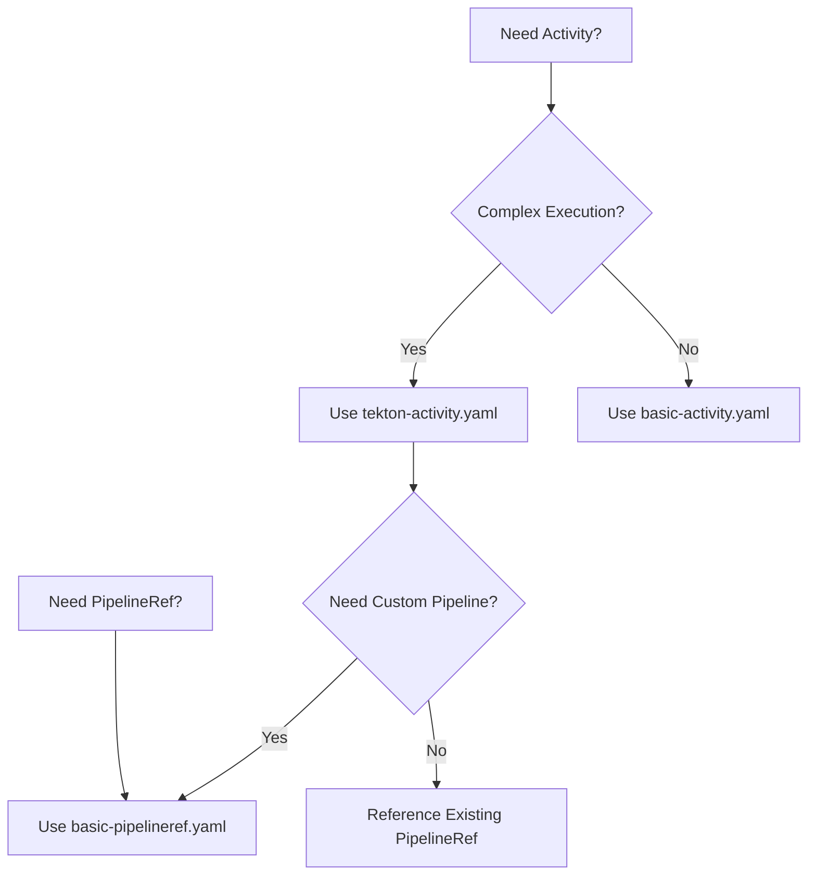

# ClrSlate Template Library

This directory provides a foundation for organizing ClrSlate templates based on actual platform specifications.

**GROUNDING REQUIREMENT**: All templates must be grounded in documented ClrSlate platform capabilities. Template development follows guidelines in `../../agent-instruction.md`.

## Template Organization Framework

Templates are organized by ClrSlate component types:

### ClrSlate Component Categories
- **Models** (`categories/models/`): Templates for model definitions and data schemas
- **Activities** (`categories/activities/`): Templates for activity specifications
- **Secrets** (`categories/secrets/`): Templates for secret definitions
- **Handlers** (`categories/handlers/`): Templates for invocation handler configurations
- **Wrappers** (`categories/wrappers/`): Templates for resource wrapper models

### Indexing Framework
Templates can be indexed by:
- **Complexity**: Based on the number of ClrSlate components involved
- **Component Type**: Based on ClrSlate component types and patterns
- **Handler Type**: Based on available execution handlers

## Directory Structure

```
templates/
├── README.md                    # This file - template library overview
├── metadata-schema.json        # JSON schema for template metadata
├── categories/                  # Template categories (based on ClrSlate platform specs)
│   ├── models/                 # Model definition templates (from ModelDefinition.md)
│   ├── activities/             # Activity templates (from activity-specification.md)
│   ├── secrets/               # Secret templates (from SecretDefinition.md)
│   ├── handlers/              # Handler templates (from invocationHandlers/)
│   └── wrappers/              # Wrapper templates (from WrapperModel.md)
├── validation/                 # Template validation rules
│   ├── rules.yaml            # Validation rule definitions
│   └── examples/             # Validation examples
└── index/                     # Template indexing and search
    ├── by-category.md        # Templates organized by category
    ├── by-complexity.md      # Templates organized by complexity
    └── by-use-case.md        # Templates organized by use case
```

## Template Standards

All templates must:

1. **Be grounded in ClrSlate platform documentation**: Every template must reference specific ClrSlate platform specifications
2. **Include metadata**: Category, source documentation file, component types used
3. **Follow validation rules**: Based on constraints found in existing ClrSlate specifications
4. **Provide AI guidance**: Decision criteria for template selection based on documented capabilities

## Template Structure

Each template should include:

1. **Source Reference**: Which ClrSlate platform specification this template is based on
2. **Component Mapping**: How this template maps to documented ClrSlate components
3. **Template Code**: Configuration based on actual ClrSlate specifications
4. **Validation Rules**: Requirements derived from ClrSlate platform documentation
5. **Usage Context**: When to use based on documented capabilities

## Development Guidelines

- Only create templates for components documented in ClrSlate platform
- Reference specific sections of ClrSlate platform documentation
- Do not add features or capabilities not found in ClrSlate platform
- Base validation rules on constraints mentioned in existing specs
- Use examples from `Samples/model-definitions/` as foundation

For template metadata schema and validation framework, see `metadata-schema.json` and `validation/rules.yaml`.

## Current Status

Template infrastructure is established but requires content creation based on analysis of ClrSlate platform documentation. No speculative templates should be added until they can be properly grounded in the existing ClrSlate specifications.

## Available Templates

### Activity Templates (`activities/`)
**Source**: Based on `activity-specification.md` and invocation handler documentation

- **[basic-activity.yaml](./activities/basic-activity.yaml)** - Console handler activity for debugging and validation
  - **Complexity**: Basic
  - **Use Case**: Debugging, configuration validation, status display
  - **Handler**: Console
  
- **[tekton-activity.yaml](./activities/tekton-activity.yaml)** - Tekton PipelineRef activity for complex execution
  - **Complexity**: Intermediate  
  - **Use Case**: Complex operations, credential handling, multi-step workflows
  - **Handler**: Tekton PipelineRef

### Execution Templates (`execution/`)
**Source**: Based on `invocationHandlers/tekton-pipelineref.md` and `models.cs`

- **[basic-pipelineref.yaml](./execution/basic-pipelineref.yaml)** - Tekton PipelineRef with secret mounting
  - **Complexity**: Intermediate
  - **Use Case**: Reusable pipeline patterns, credential handling
  - **Features**: Secret mounting, parameter mapping, file templating

## Template Usage Guidelines

### AI Agent Template Selection

Use this decision framework for template selection:



### Template Customization Points

Each template includes customization metadata:

```yaml
templateMetadata:
  aiCriteria:
    whenToUse: <selection-criteria>
    alternatives: [<alternative-templates>]
    customizationPoints: [<configurable-aspects>]
```
